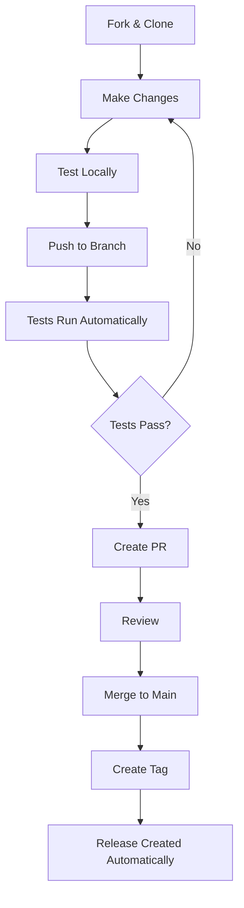

# Project Structure

This document describes the organization of the Load Multiple ENV Files action repository.

## Directory Layout

```
load-multiple-env-action/
├── .github/
│   ├── workflows/
│   │   ├── test.yml          # Automated tests
│   │   └── release.yml       # Release automation
│   └── dependabot.yml        # Dependency updates config
├── examples/
│   ├── README.md             # Examples documentation
│   └── usage-example.yml     # Comprehensive usage examples
├── test/
│   └── apps/frontend/        # Test directory structure
├── action.yml                # Action definition (MAIN FILE)
├── CHANGELOG.md              # Version history
├── CONTRIBUTING.md           # Contribution guidelines
├── LICENSE                   # MIT License
├── PUBLISHING.md             # Publishing instructions
├── QUICK_START.md            # 5-minute getting started guide
├── README.md                 # Main documentation
├── PROJECT_STRUCTURE.md      # This file
└── .gitignore                # Git ignore rules
```

## Key Files

### `action.yml`
**The heart of the action.** Defines:
- Action metadata (name, description, branding)
- Input parameters
- Composite run steps (the bash script that does the work)

### `README.md`
Comprehensive documentation including:
- Features and usage
- Input/output specifications
- Examples
- Troubleshooting
- Related actions

### `.github/workflows/test.yml`
Automated test suite covering:
- Basic functionality
- Missing file handling
- Override behavior
- Comments and empty lines
- Conditional loading
- Fail-on-missing mode
- Whitespace handling
- Variable logging

### `.github/workflows/release.yml`
Automates release process:
- Creates GitHub releases from tags
- Extracts changelog for release notes
- Updates major version tags (v1, v2, etc.)
- Handles pre-release versions

### `examples/`
Real-world usage examples:
- Basic usage
- Multi-environment setup
- Monorepo configuration
- Matrix strategies
- Full CI/CD pipelines

## File Purposes

| File | Purpose | Audience |
|------|---------|----------|
| `action.yml` | Action definition | GitHub Actions runtime |
| `README.md` | Main documentation | Users |
| `QUICK_START.md` | Getting started quickly | New users |
| `CONTRIBUTING.md` | Contribution guide | Contributors |
| `PUBLISHING.md` | Publishing instructions | Maintainers |
| `CHANGELOG.md` | Version history | Users & contributors |
| `LICENSE` | Legal terms | Everyone |
| `PROJECT_STRUCTURE.md` | Architecture overview | Developers |
| `.github/workflows/test.yml` | Test automation | CI/CD |
| `.github/workflows/release.yml` | Release automation | CI/CD |
| `.gitignore` | Ignored files | Git |
| `examples/` | Usage examples | Users |

## Development Workflow



## Release Process

1. Update `CHANGELOG.md` with new version
2. Commit changes
3. Create and push tag: `git tag v1.0.0 && git push origin v1.0.0`
4. GitHub Action automatically:
   - Creates GitHub release
   - Extracts changelog
   - Updates major version tag (v1)

## Testing Strategy

### Automated Tests (CI)
- Run on every push and PR
- Cover all major features
- Test both happy paths and edge cases
- Use matrix strategy for different scenarios

### Manual Testing
1. Create test repository
2. Reference action by branch
3. Create test `.env` files
4. Verify behavior in Actions tab

## How It Works

### Action Flow

```
1. User defines files in workflow
   ↓
2. Action receives files input
   ↓
3. For each file:
   - Check if exists
   - Load if found, skip if not
   - Append to $GITHUB_ENV
   - Track statistics
   ↓
4. Display summary
   ↓
5. Variables available in subsequent steps
```

### File Loading Logic

```bash
files=(.env.common .env.production apps/api/.env.common)
  ↓
for file in "${files[@]}"; do
  if exists(file):
    read line by line
    skip comments (#)
    skip empty lines
    export to $GITHUB_ENV
  else:
    skip (or fail if fail-on-missing=true)
done
```

## Architecture Decisions

### Why Composite Action?
- No Docker overhead
- Fast execution
- Simple bash script
- Easy to understand and modify
- Cross-platform (Linux, macOS, Windows)

### Why Bash?
- Native to GitHub Actions runners
- No dependencies required
- Simple text processing
- Reliable and well-tested

### Why Line-by-Line Loading?
- Handles comments properly
- Skips empty lines gracefully
- Preserves whitespace in values
- More control over processing

## Extension Points

The action can be extended by:

1. **Adding new inputs** (in `action.yml`)
   - Variable expansion support
   - Custom comment syntax
   - Different export targets

2. **Enhancing the script** (in `action.yml` runs section)
   - Better error messages
   - More detailed logging
   - Performance optimizations

3. **Adding tests** (in `.github/workflows/test.yml`)
   - Edge cases
   - Performance tests
   - Security tests

## Maintenance

### Regular Tasks
- Monitor and respond to issues
- Review and merge PRs
- Update dependencies (Dependabot helps)
- Improve documentation
- Add tests for new features

### Version Management
- Follow semantic versioning
- Update CHANGELOG.md
- Tag releases properly
- Maintain major version tags

## Contributing

See [CONTRIBUTING.md](CONTRIBUTING.md) for detailed guidelines.

Quick checklist:
- [ ] Tests pass
- [ ] Documentation updated
- [ ] CHANGELOG.md updated
- [ ] Code follows existing style
- [ ] Commit messages are clear

## Questions?

- 📖 Read the [README](README.md)
- 🚀 Check [Quick Start](QUICK_START.md)
- 💡 See [Examples](examples/)
- 🐛 [Open an Issue](../../issues)
- 💬 Start a [Discussion](../../discussions)

